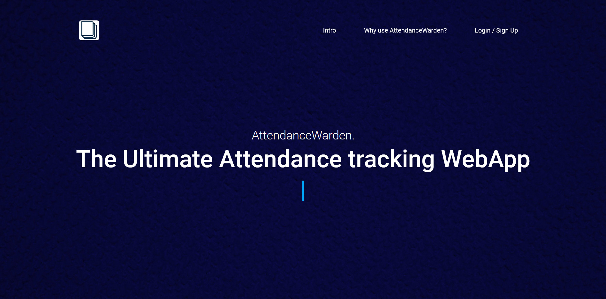
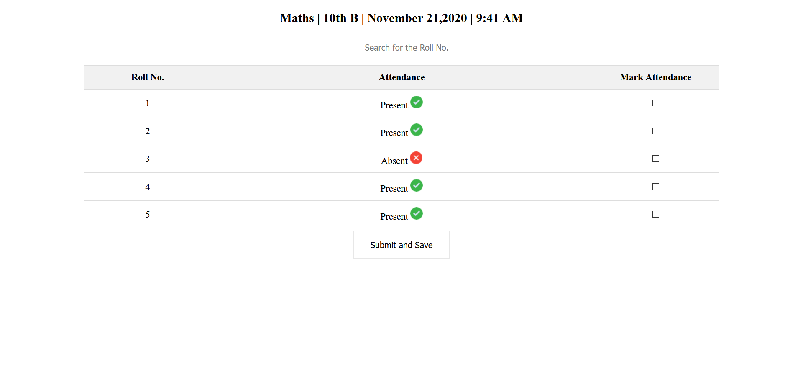
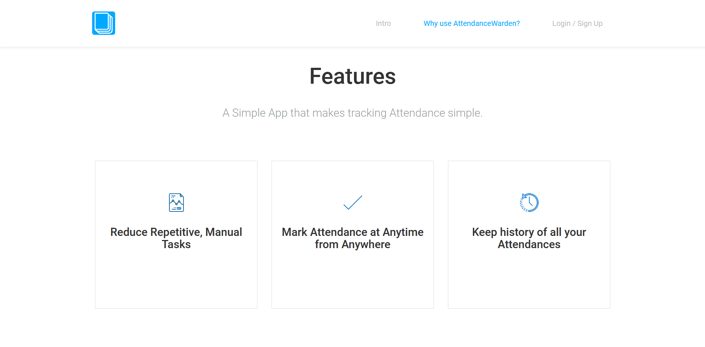
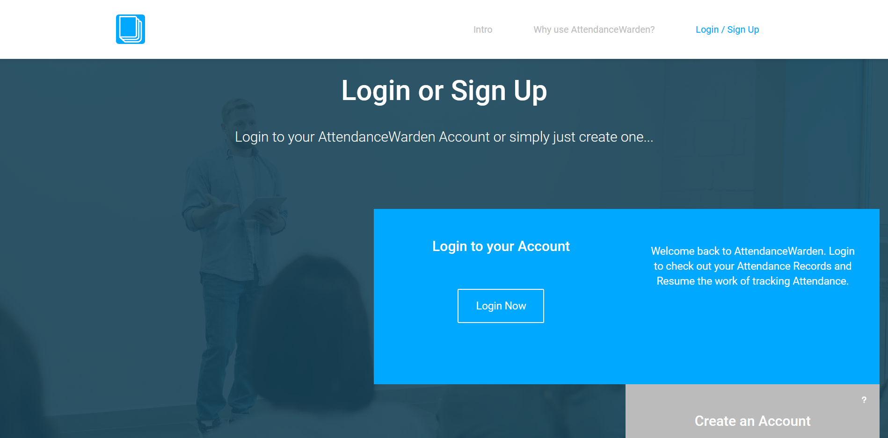

# AttendanceWarden. (Under Development) 

The Ultimate Attendance tracking WebApp. AttendanceWarden is a Simple App that makes the task of Tracking Attendance Simple.

 

## Author 
> Nishkarsh Dubb and Shivangi Sharma

## Live Demo 

[https://attendancewarden--demo.herokuapp.com/](https://attendancewarden--demo.herokuapp.com/)

## Screenshots 📷

## Why use AttendanceWarden? 💡 

### + Reduce Repetitive, Manual Tasks: 

Spend less time on repetitive manual tasks like data entry and focus on the job that really matters, teaching.

### + Mark Attendance at Anytime from Anywhere: 

With AttendanceWarden you can easily mark Attendances no matter where you are or what time it is...

### + Keep history of all your Attendances: 

AttendanceWarden keeps history of all your Attendances without any need of access to external storage...

##  Features: 💡 

+ Track Attendences at Anytime from Anywhere, irrespective of what device you're on. With our great Responsive UI and UX our users can track attendances easily from their mobile devices.

+ Keep history of all your Attendances without any need of access to external storage.

+ Quick Attendance Report with each Attendance Sheet.

## Developed Using 💻

+ [Html](https://developer.mozilla.org/en-US/docs/Web/HTML)
+ [Css](https://developer.mozilla.org/en-US/docs/Web/CSS)
+ [Bootstrap](https://getbootstrap.com/)
+ [Javascript](https://developer.mozilla.org/en-US/docs/Web/javascript)
+ [Nodejs](https://nodejs.org/en/)
+ [Express](http://expressjs.com/)
+ [MongoDB](https://www.mongodb.com/) (The App will be linked to a DB very soon...)

## Installation or Getting Started

Run the following command in the terminal:

	git clone https://github.com/Nishkarsh01/AttendanceWarden..git
or download the zip file from github.
    

## Usage
After extracting the files,

    cd AttendanceWarden.
    npm install 
    node App.js
    
  
## Developed By

Team Nishkarsh,( [Nishkarsh Dubb ](http://nishkarshdubb-fullstack.herokuapp.com/) and [Shivangi Sharma ](https://www.linkedin.com/in/shivangiisharma/) ) for [Octahacks3.0](https://octahacks.tech/)
